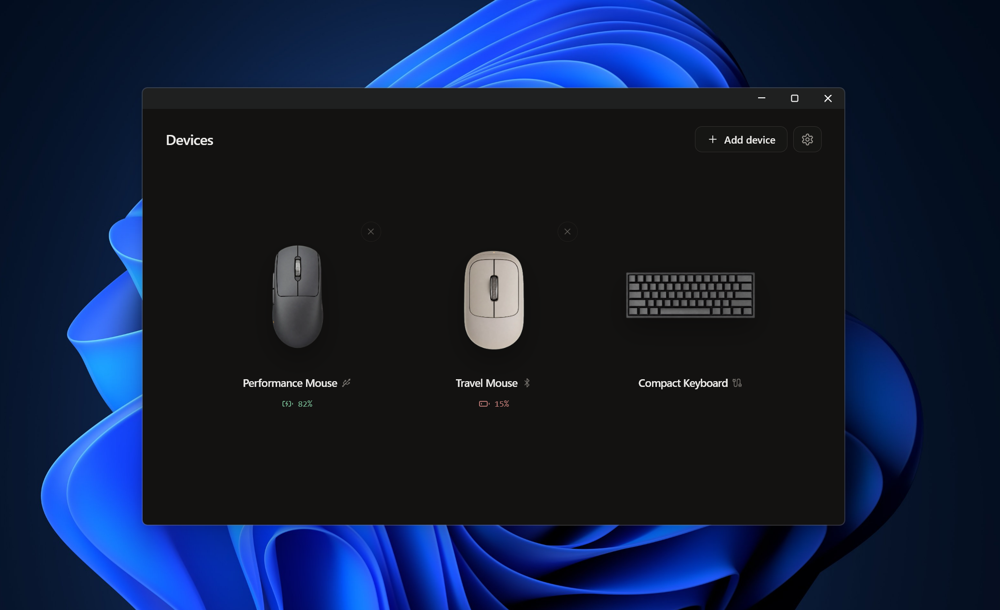
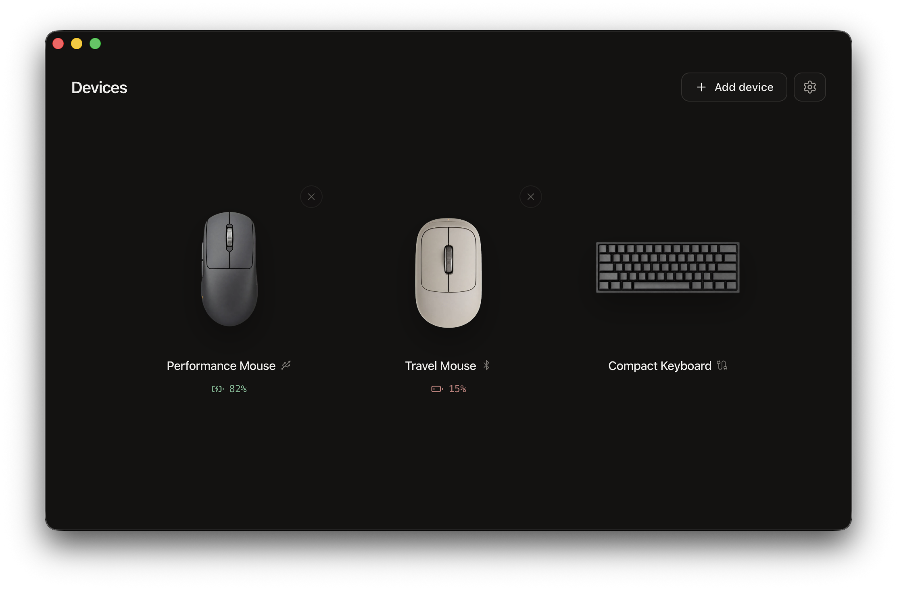
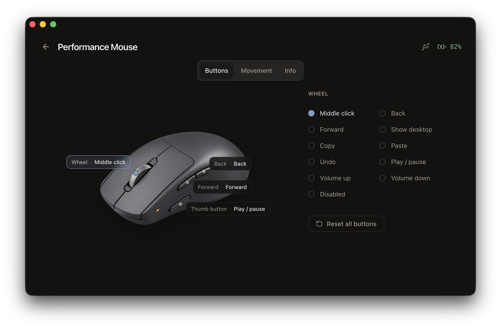
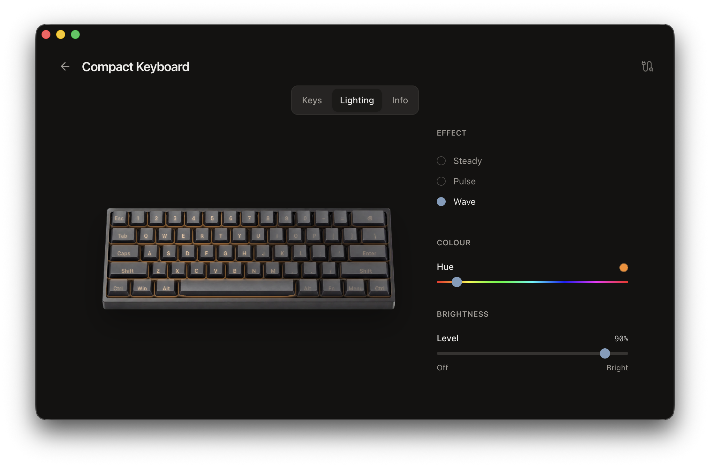
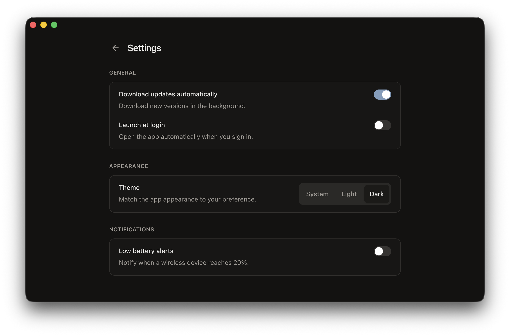

# MōDevice — a peripherals configuration demo

MōDevice is a small reference application for configuring mice and keyboards, built with
[MōBrowser](https://teamdev.com/mobrowser/). It demonstrates a desktop architecture with a React
interface, a TypeScript application process, and a native C++ device layer.

The demo looks and behaves like real device configuration software while keeping the source code
small and easy to follow.

<a href="assets/screenshots/windows-devices.png"></a>

## What the demo shows

- View mice and keyboards with their connection, battery, and firmware information.
- Find, add, and remove wireless devices.
- Assign actions to mouse buttons and adjust pointer and scrolling behavior.
- Remap keyboard keys and configure backlight effects, color, and brightness.
- Change the app theme, launch it at login, manage updates, and enable low-battery alerts.
- Keep paired devices and settings between launches.

<p align="center">
  <a href="assets/screenshots/macos-devices.png"></a>
  <a href="assets/screenshots/macos-mouse-buttons.png"></a>
</p>

<p align="center">
  <a href="assets/screenshots/macos-keyboard-lighting.png"></a>
  <a href="assets/screenshots/macos-settings.png"></a>
</p>

All devices are simulated by an in-memory C++ backend. This app does not detect or change real
peripherals connected to the computer. It is a reference demo, not production device software.

The demo requires no account or API key. Packaged versions contact GitHub Releases to check for
updates, but device data and settings are not sent anywhere.

## Requirements

- macOS 14 or later on Apple silicon, or Windows 10 or later on 64-bit systems.
- [Node.js](https://nodejs.org/en/download/) 20.20.2, 22.22.2, or 24.14.1 and later.
- [MōBrowser](https://teamdev.com/mobrowser/) 2.13.0 or later.

## Run from source

```bash
npm install
npm run dev
```

To create a production build:

```bash
npm run build
```

## Project structure

- `src/native/device_stack.*` contains the simulated devices and is the main starting point for a
  real hardware integration.
- `src/native/device_service.*` exposes the device stack to MōBrowser.
- `src/main/devices.ts` passes device data between C++ and the interface and saves the demo state.
- `src/renderer/gateway/devices.ts` is the interface's single entry point for device operations.
- `src/renderer/components/device/` contains the shared device screen and the separate mouse and
  keyboard editors.
- `src/renderer/public/device-art/` contains the product images shown in the app.

## Connect real devices

Replace the simulated implementation in
[`src/native/device_stack.cc`](src/native/device_stack.cc) with calls to your device SDK or system
APIs. Keep the interface in [`src/native/device_stack.h`](src/native/device_stack.h) if its operations
fit your integration.

The demo saves paired device IDs and settings in [`src/main/devices.ts`](src/main/devices.ts). If
your devices or SDK already store this data, remove that persistence and keep one source of truth.

### Add capabilities and device types

For another mouse or keyboard, reuse the existing screens where possible.

- `src/native/device_stack.cc` reports the controls and value ranges supported by each device.
- `device-art.tsx` connects each `modelId` to its artwork, while
  `src/renderer/public/device-art/` stores the image files.
- `mouse-device.ts` and `keyboard-device.ts` define the sections, actions, and labels shown for each
  device type.
- `mouse-editor.tsx` and `keyboard-editor.tsx` render the controls used to change device settings.

For a different device category, give it its own capabilities, settings, editor, and artwork. Keep
the shared device screen responsible only for layout and navigation.

- `src/native/proto/devices.proto` and `src/renderer/proto/devices.proto` describe the capabilities
  and settings shared between the app layers.
- A new device module in `src/renderer/components/device/` describes the sections and artwork
  behavior for the device type.
- A new editor module in the same folder renders its settings controls.
- `device-presentation.ts` chooses the matching device module, and `control-editor.tsx` chooses its
  editor.
- `device-art.tsx` renders the matching artwork from `src/renderer/public/device-art/`.

## Download

You can download the app from the [releases page](https://github.com/mo-browser-apps/device/releases).
macOS releases are code-signed and notarized by Apple; Windows releases are code-signed.

## License

MIT — see [LICENSE](LICENSE).
